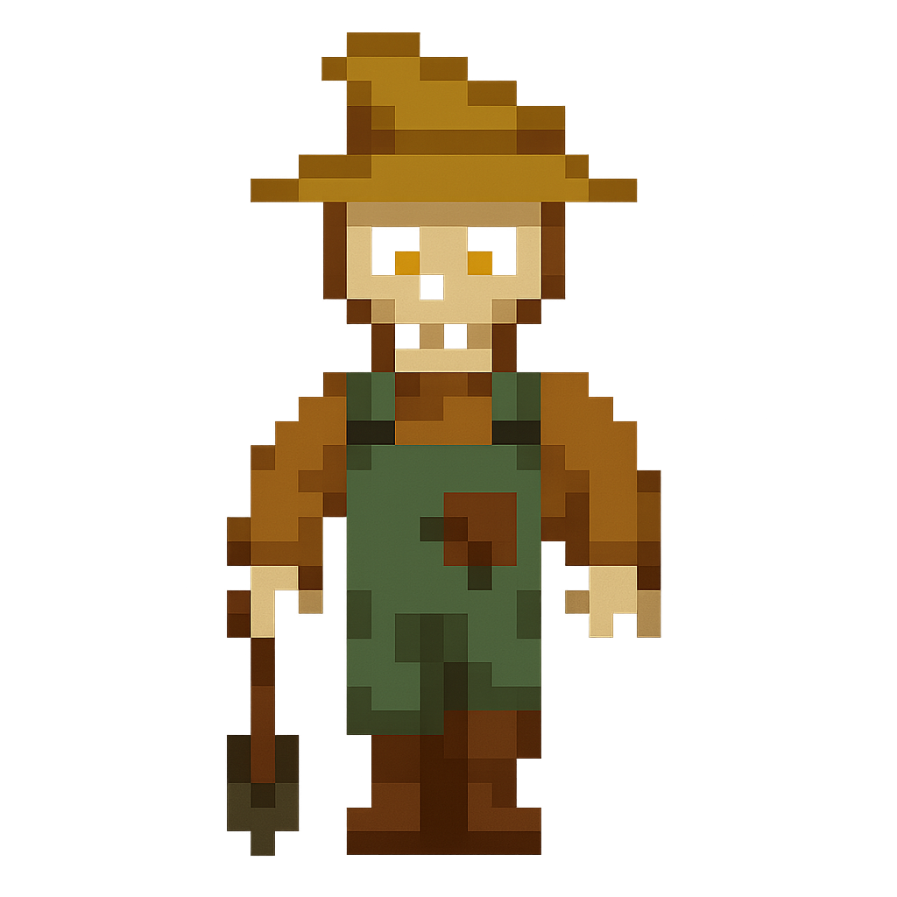
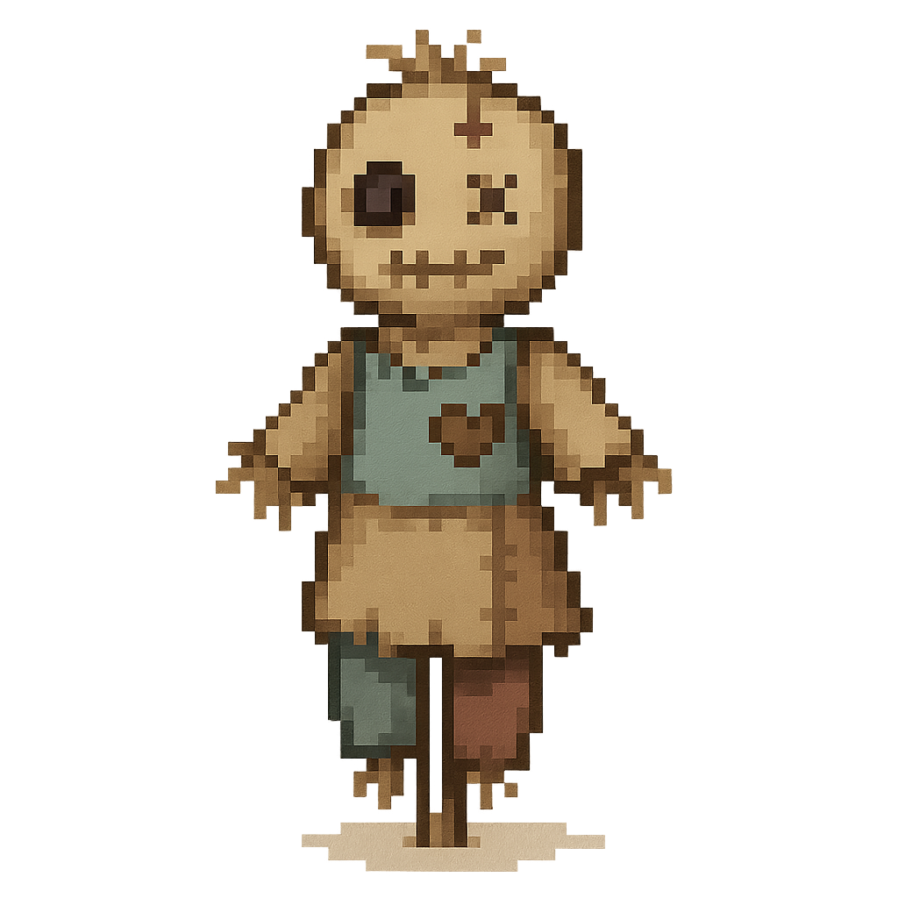
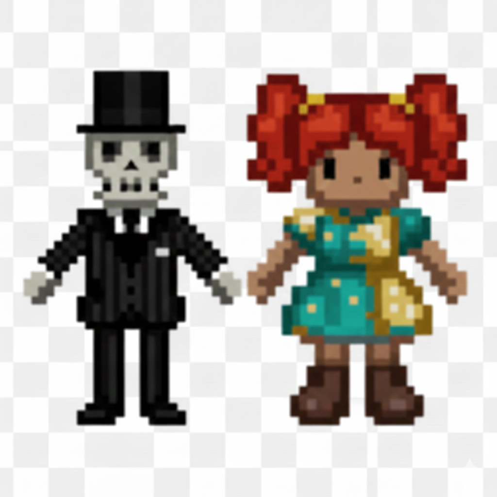
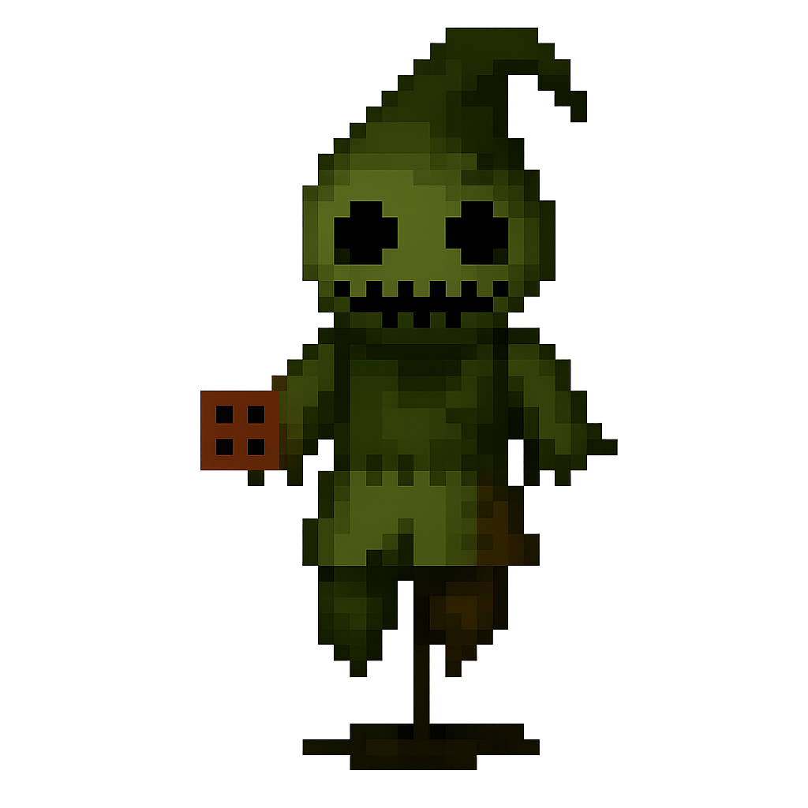

# NBC Rarecrows

A Stardew Valley Content Patcher mod that adds custom copyright-safe rarecrow sprites with a configurable sprite set and optional shop behavior changes.

## Concept Art

## Install

1. Install [SMAPI](https://smapi.io/).
2. Install [Content Patcher](https://www.nexusmods.com/stardewvalley/mods/1915).
3. Extract this mod into `Mods/NBC Rarecrows`.

## Configure

Open `config.json`, or use [Generic Mod Config Menu](https://www.nexusmods.com/stardewvalley/mods/5000) if installed. Settings are grouped by section.

### Rares
- `EnableGentleman`
- `EnableSeamstress`
- `EnablePatchworkGuardian`
- `EnableSkeletonFarmer`
- `EnableGhostDog`
- `EnablePumpkinKing`

### Shops
- `EnableSpiritsEve`
- `EnableTravelingCart`
- `EnableNightMarket`
- `PriceSpiritsEve`
- `PriceTravelingCart`
- `PriceNightMarket`
- `StockPerPlayer`

### Rarity
- `AllAreRare`: if true, each rarecrow can be purchased once per player ever; if false, stock limits control availability.

### Sprites
- `SpriteSet`: `Primary` or `Testing`.

### Bonuses
- `EnableSkeletonFarmerBones`: Skeleton Farmer produces Bone Fragments daily.
- `EnableGuardianCandy`: Patchwork Guardian produces Magic Rock Candy on Fall 26–27.
- `EnableGhostDogGifts`: Ghost Dog produces a themed item every other day, seasonally weighted.
- `EnablePumpkinKingGifts`: Pumpkin King produces a themed item every other day during Fall and Winter.
- `EnableSpiritsEveCostumeDrops`: Fall 27 costume hats for players who own the related rarecrow.

## Uninstall

Remove the `Mods/NBC Rarecrows` folder.

## Credits

- Sprites and content created with help from generative AI; C01DB100DED provided direction and assembly.

## Artwork

The `Artwork/` folder in this repo contains higher-resolution concept/reference images used during sprite creation. These are included for reference and not needed to run the mod.
